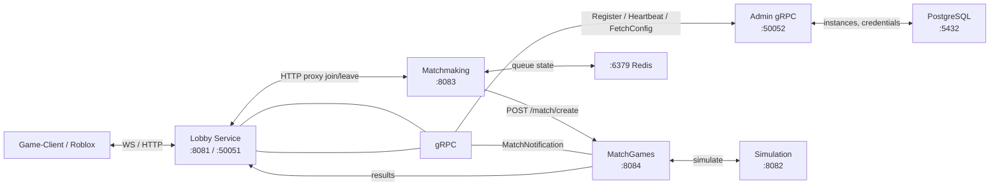

# AGENTS.md

This file provides guidance to Claude Code (claude.ai/code) when working with code in this repository.

## Repository Overview

AutoChess Fullstack is a modular auto-battler game built as a Git submodule monorepo with 4 Rust backend services, an admin panel, and a game client.

```
Admin-Area/Admin-Panel/         # Laravel 12 (PHP 8.2) — fleet management, secrets, pairing
Backend/Backend-General/        # Rust (tokio/axum/tonic) — lobby, auth, WebSocket hub, gRPC server
Backend/Backend-Matchmaking/    # Rust (tokio/axum) — Redis-backed matchmaking queue
Backend/Backend-MatchGames/     # Rust (tokio/axum) — match lifecycle, round orchestration
Backend/Backend-Simulation/     # Rust (tokio/axum/tonic) — tick-by-tick combat engine
Backend/Backend-AdminGrpc/      # Rust (tonic) — gRPC gateway for Admin Panel pairing (port 50052)
Frontend/Game-Client/           # Godot 4.x (GDScript) — visual client, WebSocket consumer
Frontend/Game-Roblox/           # Roblox (Luau) — HTTP REST client for Roblox platform
```

## Common Commands

### Full Stack (Docker)
```bash
cp .env.example .env          # first time only
docker compose up -d --build  # start all services
docker compose ps             # check service health
docker compose logs -f        # follow all logs
docker compose down           # stop; add -v to destroy DB/Redis volumes
```

See `INSTALL.md` for the full first-time setup flow.

Default Admin Panel login (after seeding):
- Email: `admin@autochess.local`
- Password: `<set by seeder — change immediately after first login>`

### Service Ports (docker-compose)
| Service | Port | Notes |
|---------|------|-------|
| Admin Panel (nginx) | 3001 | Laravel interface |
| Backend-AdminGrpc | 50052 | gRPC pairing gateway (Backend-AdminGrpc) |
| Backend-General | 8081 (HTTP) / 50051 (gRPC) | Lobby, auth, WS hub |
| Backend-Matchmaking | 8083 | Matchmaking queue (Redis-backed) |
| Backend-MatchGames | 8084 | Match lifecycle, round orchestration |
| Backend-Simulation | 8082 | Tick-by-tick combat engine |
| PostgreSQL | 5432 | `admin_panel` database (all backends) |
| Redis | 6379 | Matchmaking queue |

### Backend Services (Rust)
```bash
cd Backend/Backend-General       && cargo run  # Lobby service (8081)
cd Backend/Backend-Matchmaking   && cargo run  # Queue service (8083)
cd Backend/Backend-MatchGames    && cargo run  # Match lifecycle (8084)
cd Backend/Backend-Simulation    && cargo run  # Combat engine (8082)
```

### Admin Panel (Laravel)
```bash
cd Admin-Area/Admin-Panel
docker compose exec admin-panel php artisan migrate --force
docker compose exec admin-panel php artisan db:seed --class=InitialSetupSeeder --force
docker compose exec admin-panel php artisan test
```

## Architecture

### 4-Service Backend Architecture


### Database
All backends share the `admin_panel` PostgreSQL database (no separate `autochess` DB).
Tables: `players`, `matches`, `match_history`, `instances`, `project_credentials`, `users`.

### Instance Pairing (gRPC)
All backend instances generate a ULID on first boot (persisted to `instance_id.txt`) and call
`Backend-AdminGrpc:50052` via gRPC to:
1. **RegisterInstance** — receive a `pairing_key`, stored in `pairing.json`
2. **Heartbeat** every 30 s — keeps instance status alive in DB
3. **FetchConfig** — pull credential groups from `project_credentials`

`Backend-AdminGrpc` is a thin Rust gRPC gateway that reads/writes the `admin_panel` DB directly
(no Laravel dependency).

### Config Resolution Order (Rust backends)
1. Environment variables (`.env` or OS)
2. `instance_id.txt` (ULID, generated once)
3. `pairing.json` (written after gRPC RegisterInstance)
4. Remote Admin Panel export via gRPC FetchConfig

### Admin-Panel (Laravel)
- `app/Models/Instance` — Backend instances (name, type, endpoint, pairing_key, status)
- `app/Models/ProjectCredential` — Key/value secrets grouped by project name
- `app/Http/Controllers/Api` — Heartbeat + config export endpoints
- `routes/api.php` — `POST /api/v1/instances/heartbeat`, `GET /api/v1/instances/export`

## Submodule Management
```bash
git submodule update --init --recursive   # after clone
git submodule update --remote --merge     # pull latest for all submodules
```

## Key Documentation
- `README.md` — project overview and submodule pointers
- `INSTALL.md` — full first-time setup
- `PROGRESS.MD` — high-level phased progress tracker
- `Documentation/PRD/` — service-level product requirements
- `CLAUDE.md` → symlink to this file
- Each submodule has its own `AGENTS.md` / `CLAUDE.md` for local guidance

## Commit Conventions
- Never add "model" or "cli" (or any AI/model/assistant name) to the git commit's `Co-Authored-By` trailer.
