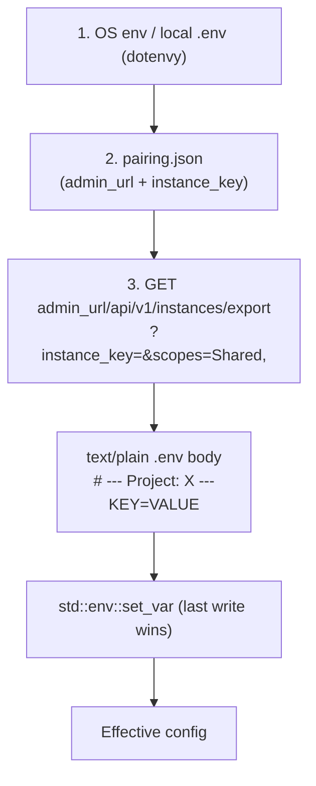
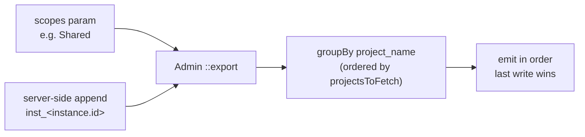
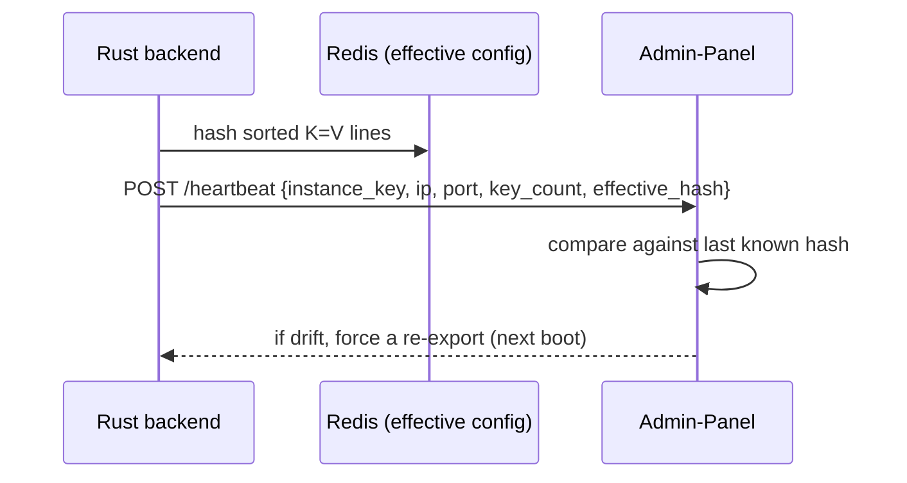

# Credentials & Configuration Spec

> **Purpose:** Single source of truth for how configuration and secrets
> flow between the Admin-Panel (Laravel) and the two Rust backends
> (`Backend-General`, `Backend-Simulation`). Both backends conform; either
> may be reimplemented without changing the wire format.

---

## 1. Surface

The Admin-Panel exposes exactly four HTTP endpoints that the Rust backends
call:

| Verb  | Path                              | Direction   | Body / Query |
|-------|-----------------------------------|-------------|--------------|
| POST  | `{endpoint}/api/v1/pair`          | Admin → BE  | `{admin_url, pairing_key}` |
| POST  | `{endpoint}/api/v1/unpair`        | Admin → BE  | `{pairing_key}` |
| POST  | `/api/v1/instances/heartbeat`     | BE → Admin  | `{instance_key, ip, port, key_count, effective_hash}` |
| GET   | `/api/v1/instances/export`        | BE → Admin  | query `instance_key`, `scopes` (comma-separated) |

The export endpoint returns **plain text** (`Content-Type: text/plain`)
formatted as a `.env`-style key/value stream (one `KEY=VALUE` per line,
comments start with `#`, optional blank lines between groups).

## 2. Scopes

A scope is a label that groups `ProjectCredential` rows in the Admin
schema. Each credential row has exactly one scope (`project_name`) and
ships a `key`, a `value`, and an `is_secret` flag.

### 2.1 Scope taxonomy

There are **two kinds** of scopes and the system must support many of
each kind:

| Scope kind   | Naming                          | Examples                                  |
|--------------|---------------------------------|-------------------------------------------|
| **Shared**   | Fixed labels                     | `Shared`, `Database`, `Redis`             |
| **Instance** | The instance's `id` (string)    | `inst_4a91…`, `inst_2b3c…`                 |

> **Why instance-keyed scopes?** A fleet may run many General instances
> and many Simulation instances simultaneously (multi-region, A/B, canary).
> Each instance has its own `pairing_key`, its own DB schema namespace,
> its own JWT secret, and its own log sink. Credentials must be
> scoped per-instance so a rotation in one instance never affects its
> neighbours. Backend type ("general" vs "simulation") is therefore
> **metadata about an instance**, not a scope.

### 2.2 Seeder vs runtime

| Layer | Source | Scope shape |
|---|---|---|
| Seeder (`InitialSetupSeeder`) | One-time defaults | `Shared` only |
| Operator (Blade UI) | Admin adds credentials per instance | `Shared`, `inst_<id>` |
| Manual editing | `php artisan` tinker | any string `project_name` |

The seeder only creates the `Shared` row bundle and the two default
`Instance` rows (`General-Default`, `Match-Default`). All per-instance
credential rows are added later through the Credentials CRUD UI, using
each new instance's auto-generated `id` as the `project_name`.

### 2.3 Mapping to the `instances.export` call

When an instance boots and the Admin Panel issues its
`pairing_key`, the instance is now expected to:

1. Determine its own `instance_id` from the pairing response or a
   subsequent heartbeat — the Admin Panel returns the row id on the
   pairing callback. (If not yet returned, the backend re-fetches its
   own row via `GET /api/v1/instances/me?instance_key=...` and uses
   that id.)
2. Request `GET /api/v1/instances/export?instance_key=...&scopes=Shared`
   (and the Admin Panel **always appends** `inst_<id>` to the scope
   list, just like it currently appends `$instance->type`).
3. Merge in arrival order: `Shared` first, `inst_<id>` last. Last
   write wins. Per-instance secrets override shared defaults.

### 2.4 Example

Instance id `inst_4a91…` (a "general" type instance). Admin DB has:

```
(project_name = 'Shared',  key = 'REDIS_URL', value = 'redis:6379')
(project_name = 'inst_4a91', key = 'JWT_SECRET', value = '…')
(project_name = 'inst_4a91', key = 'DATABASE_URL', value = '…')
(project_name = 'inst_4a91', key = 'PORT', value = '8081')
```

`GET /api/v1/instances/export?instance_key=…&scopes=Shared` returns:

```
# --- Project: Shared ---
REDIS_URL=redis:6379

# --- Project: inst_4a91 ---
JWT_SECRET=…
DATABASE_URL=…
PORT=8081
```

A future "general-blue" instance id `inst_2b3c…` ships its own
`JWT_SECRET`, `DATABASE_URL`, `PORT` row in scope `inst_2b3c`,
invisible to the first instance.

---

## 3. Resolution order (each Rust backend at startup)



Layer 3 is authoritative for every key the Admin Panel exports.

- **Layer 1** sets defaults so the binary boots without the Admin Panel
  (useful for local dev and tests).
- **Layer 2** flips the backend into "paired" mode and tells it where the
  Admin Panel lives.
- **Layer 3** runs once during boot and is re-issued whenever the Admin
  Panel rotates a credential.

## 4. Merge semantics in the Admin export



The Admin implementation now computes
`array_merge($scopes, ['inst_' . $instance->id])` — the **last scope is
always the instance's own `inst_<id>`**, regardless of how many
General or Simulation instances exist. **Last write wins** — a
`Shared` key is always overridden by the same key in `inst_<id>`,
and one instance never sees another instance's per-scope keys.

---

## 5. Backend behavior on the received `.env` body

1. Split into lines. Trim. Drop empty lines and `#`-comment lines.
2. Parse `KEY=VALUE` (no `export ` prefix, no quoting expected).
3. Call `os.Setenv(KEY, VALUE)`. Go's `os.Setenv` is idempotent: a later
   set supersedes the earlier.
4. Track the **effective hash**:
   `sha256(sorted(KEY + "\x00" + VALUE for each parsed row))`.
   This is sent back to the Admin Panel in every heartbeat.

## 6. `is_secret` handling

- Admin export always returns raw values. (Future Admin revisions may
  redact; the backend must not rely on that.)
- The Rust backends **must not log** a credential whose key matches a
  known-secret list (`JWT_SECRET`, `DATABASE_URL`, `*_KEY`,
  `*_SECRET`, `*_TOKEN`, `*_PASSWORD`, `*PASSWD`).
- Heartbeats emit `key_count` and `effective_hash` only — never values.

## 7. Heartbeat back-pressure



Backends include two new fields in the heartbeat body:

| Field           | Type | Meaning |
|-----------------|------|---------|
| `key_count`     | int  | Number of unique keys applied from the export |
| `effective_hash`| str  | 64-char lowercase hex SHA-256 of sorted `K=V` lines |

The Admin UI surfaces drift (hash mismatch) under the Instance detail
view and offers a "Re-push credentials" button that triggers an
administrator-side re-`pair` cycle.

## 8. Local development

Both `Backend-General/.env.example` and `Backend-Simulation/.env.example`
ship with the seeder's defaults inlined so `cargo run` works without the
Admin Panel running. Production instances pair through the Admin Panel
and never see those inlined defaults. Each instance scopes by its
own `inst_<id>` rather than by type, so secrets never leak across the
fleet.

---

## Change log

- **2026-08-27** — Initial spec. Matches Admin-Panel
  `Api\InstanceController::export`, `InitialSetupSeeder`, and parent
  `PLAN.md` §3.1.
- **2026-08-27** — Scope taxonomy split into *Shared* + *Instance-keyed*
  (`inst_<id>`). Many General and many Simulation instances are first-class
  citizens; per-instance secrets are scoped per instance id, not per type.
  See §2.1.
