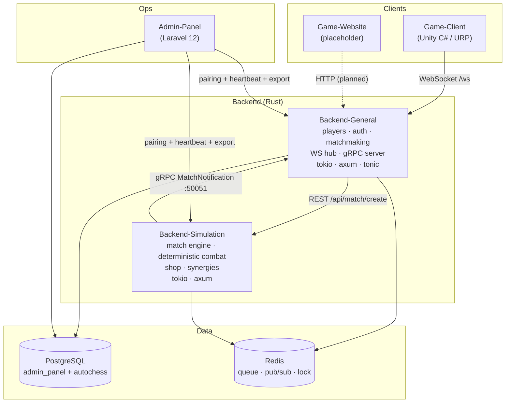
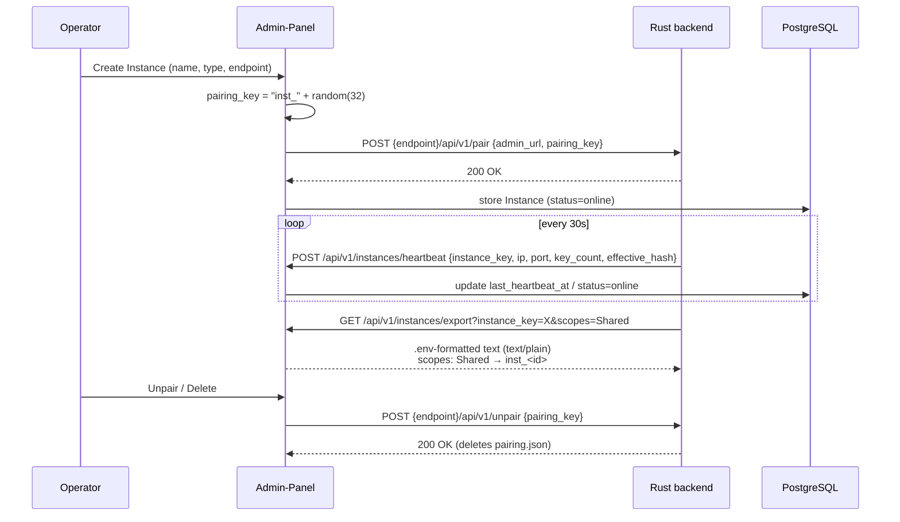
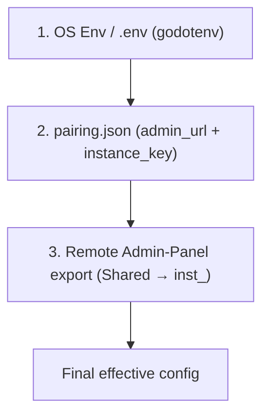
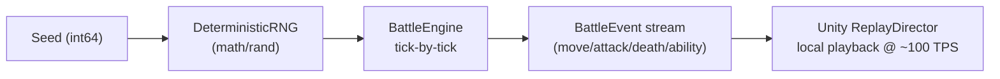
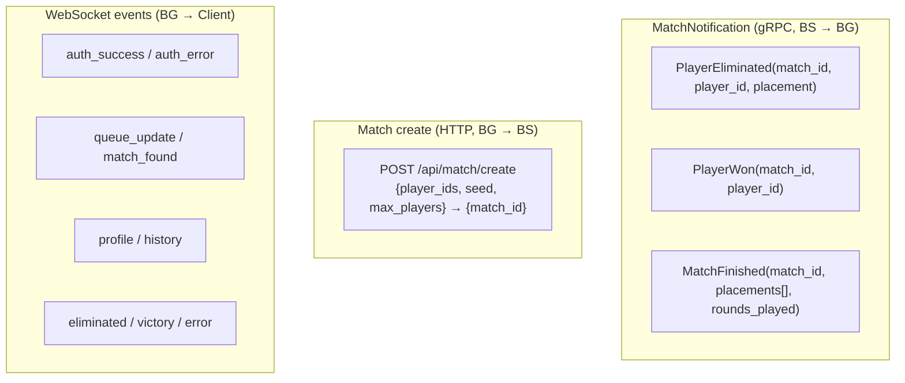
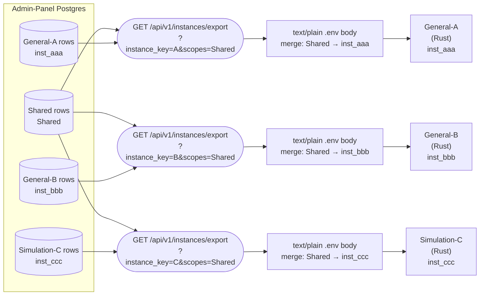
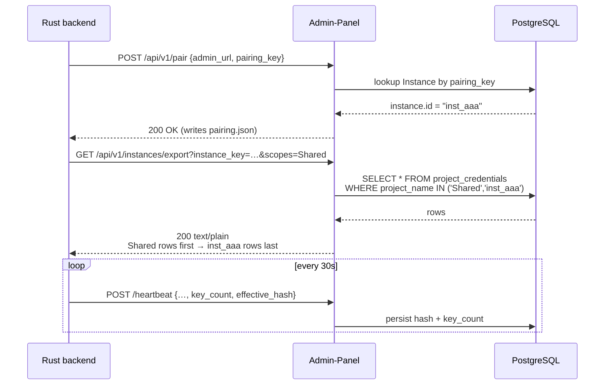
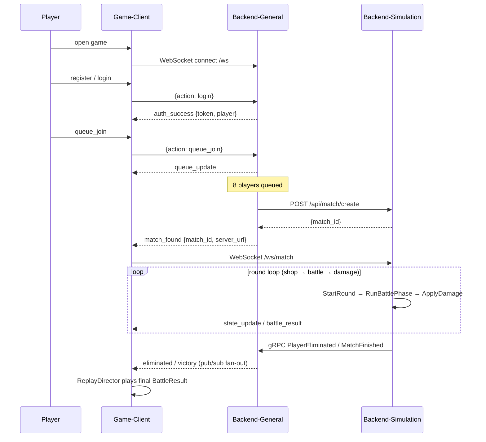
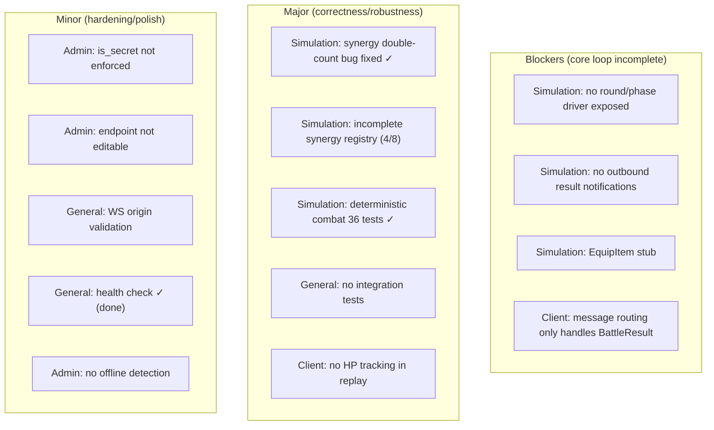
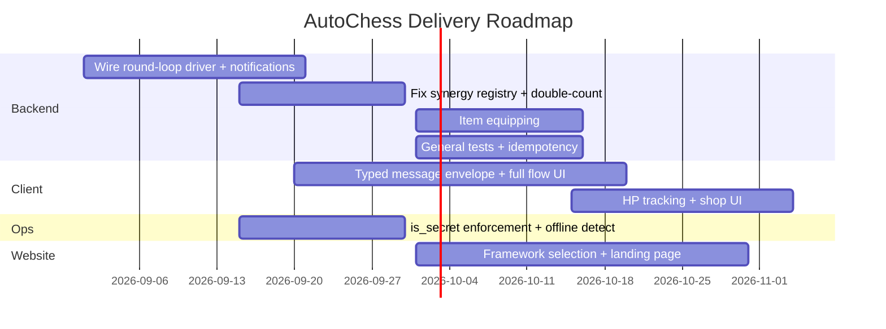

# AutoChess Fullstack — Product Requirements Document (PRD)

> **Type:** PRD · **Scope:** Main monorepo (orchestration + cross-component contracts)
> **Date:** 2026-08-19 · **Status:** Reflects verified implementation state (not just docs)

---

## 1. Context

AutoChess Fullstack is a modular auto-battler inspired by *Teamfight Tactics* and *Magic Chess*.
Players draft units, manage economy, and watch their team battle automatically on a 6×7 grid.
The product is a **Git submodule monorepo** spanning five independently-versioned components:

| Component | Stack | Role | Status |
|-----------|-------|------|--------|
| Admin-Area/Admin-Panel | Laravel 12 (PHP 8.2) | Fleet management, secrets, pairing | ~95% |
| Backend/Backend-General | Rust (tokio/axum/tonic) | Players, auth, matchmaking, WS hub, gRPC server | ~85% |
| Backend/Backend-Simulation | Rust (tokio/axum) | Match engine, deterministic combat, shop, synergies | ~90% |
| Frontend/Game-Client | Godot 4.x (GDScript) | Visual playback engine, WebSocket consumer | Pending |
| Frontend/Game-Website | (undecided) | Landing page + player portal | ~10% |

> Each submodule also has its own `PLAN.md` with its full requirement breakdown. This file
> covers the **shared contracts and orchestration** that tie them together.

---

## 2. System Architecture



### Build targets

- **Backend-General** — `cargo build --release` → Linux x86_64 binary (primary); Docker (Windows)
- **Backend-Simulation** — `cargo build --release` → Linux x86_64 binary (primary); Docker (Windows)

### Service ports (docker-compose)

| Service | Port(s) | Notes |
|---------|---------|-------|
| Admin Panel (nginx) | 3001 | Laravel interface |
| Backend-General | 8081 (HTTP) / 50051 (gRPC) | REST + WS + gRPC server |
| Backend-Simulation | 8082 | Match/combat engine |
| PostgreSQL | 5432 | `admin_panel` + `autochess` databases |
| Redis | 6379 | Matchmaking queue / caching |

---

## 3. Cross-Cutting Requirements

### 3.1 Push-based pairing & config resolution

All server-side components share a **push-based pairing** lifecycle — the single most
important cross-component contract.



**Config resolution order (Rust backends, later overrides earlier):**



### 3.2 Determinism guarantee (replay)

Combat is **deterministic**: identical seed + input ⇒ identical `BattleResult` event stream.
This lets the Unity client replay a match locally without re-simulating.



- Units processed in **sorted-ID order**; BFS movement order fixed (up/down/left/right);
  nearest-enemy tie-break by (row, col).
- Match-level seed = `match.Seed + round` (+ gold for rerolls).

### 3.3 Cross-component data contracts



### 3.4 Fleet & credentials resolution

The system runs **N General instances and M Simulation instances**
simultaneously (multi-region, A/B, canary). Credentials are scoped
per-instance, never per-type. Each instance gets its own `inst_<id>`
scope; backend type is metadata only.



> **Merge order:** `Shared` → `inst_<id>`. Last write wins. One instance
> never sees another's per-scope keys. The Admin Panel always appends
> `inst_<id>` server-side regardless of what the URL query requested.



Drift detection: heartbeat carries `effective_hash`
(SHA-256 of sorted `KEY=VALUE` pairs) and `key_count`. The Admin UI
flags mismatches and offers a "Re-push credentials" action. See
`CREDENTIALS.md` for the full spec.

---

## 4. End-to-End Match Flow (target state)

The primary user journey the product must deliver.



> ⚠️ The round loop (`StartRound` → `RunBattlePhase` → `ApplyDamage`) and outbound result
> notifications are **not yet wired** in production — see the gap register below.

---

## 5. Consolidated Gap Register

Priority-ordered gaps that block the full product experience. Full details live in each
submodule's `PLAN.md`.



| # | Component | Gap | Impact | Status |
|---|-----------|-----|--------|--------|
| 1 | Simulation | No phase-advance driver | Match never progresses in production | Pending |
| 2 | Simulation | No outbound notifications | General never learns results | Pending |
| 3 | Simulation | `EquipItem` stub | Items can't be equipped | Pending |
| 4 | Client | Heuristic message routing | Client ignores auth/queue/match_found | Pending |
| 5 | Simulation | Deterministic combat | Core engine | ✅ Done (42 tests) |
| 6 | Simulation | Synergy double-count | Incorrect trait thresholds | ✅ Fixed (dedup by hero-id) |
| 7 | Simulation | Incomplete synergy registry | Most traits do nothing | Pending (4/8) |
| 8 | General | No integration tests | Regression risk | Pending |
| 9 | General | Double-record risk | Rating/stats double-applied | ✅ Fixed (idempotency + unique constraint) |
| 10 | Admin | `is_secret` not enforced | Secrets leak as plaintext | Pending |
| 11 | Admin | No offline detection | Stale "online" status | Pending |
| 12 | All | Per-fleet credential scoping | Many instances of one type share secrets | ✅ Done (inst_\<id\>) |

---

## 6. Delivery Roadmap (recommended phasing)



---

## 7. Verification (end-to-end)

```bash
# 1. Full-stack smoke
cp .env.example .env && docker compose up -d --build
docker compose exec admin-panel php artisan migrate --force
docker compose exec admin-panel php artisan db:seed --class=InitialSetupSeeder --force

# 2. Backend-Simulation (Rust) — 42 tests, determinism, synergy
cd Backend/Backend-Simulation && cargo test && cargo build --release

# 3. Backend-General (Rust) — 4 tests, auth, rating table
cd Backend/Backend-General && cargo test && cargo build --release

# 4. Admin Panel
docker compose exec admin-panel php artisan test

# 5. Health + flow
curl http://localhost:8081/healthz
```

Then: pair instances in Admin Panel → register 8 players → queue → verify `match_found` →
create match → verify round loop emits `battle_result` + gRPC callbacks (once gaps 1–2 are fixed).

---

*End of PRD. Update §5–§6 as gaps close.*
