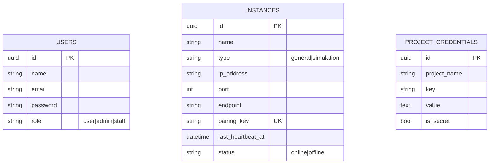

# Admin-Panel — Product Requirements Document (PRD)

> **Stack:** Laravel 12 (PHP 8.2) · Breeze (Blade + session) · Tailwind v3 + Alpine
> **Status:** ~95% complete · **Date:** 2026-08-19
> **Parent PRD:** `Documentation/PRD/backend-general-prd.md`

---

## 1. Context

Centralized fleet-management dashboard for the AutoChess infrastructure. It manages backend
instances, project credentials, and admin user accounts. It pushes pairing credentials to backend
services over HTTP, receives periodic heartbeats, and exports `.env`-formatted config.

Not player-facing — operators and administrators are the audience.

---

## 2. Requirements

| ID | Requirement | Status |
|----|-------------|--------|
| AP-1 | Instance CRUD (`name`, `type`, `endpoint`, `pairing_key`, `status`) | Done |
| AP-2 | Push-based pairing (`POST /api/v1/pair`, 5s timeout) | Done |
| AP-3 | Heartbeat endpoint — online/offline status | Done |
| AP-4 | Config export — scope-ordered `.env` text | Done |
| AP-5 | Project credentials CRUD (key/value by `project_name` scope) | Done |
| AP-6 | RBAC: `USER`/`ADMIN`/`STAFF` via `UserPolicy` | Done |
| AP-7 | Unpair action + delete-time depairing | Done |
| AP-8 | Audit logging (who changed what) | Planned |
| AP-9 | Dashboard analytics (player counts, match stats) | Planned |
| AP-10 | Automated depairing / offline detection | Planned |
| AP-11 | `is_secret` enforcement (mask/redact) | Partial |
| AP-12 | API endpoint hardening (rate limit, signed requests) | Partial |

---

## 3. Data Model



---

## 4. API Surface

| Group | Endpoints |
|-------|-----------|
| Web (Blade) | `/dashboard`, `/admin/users`, `/admin/instances`, `/admin/credentials`, `/profile` |
| API (`/api/v1`) | `POST /instances/heartbeat`, `GET /instances/export` |

---

## 5. Verification

```bash
docker compose exec admin-panel php artisan test
```
