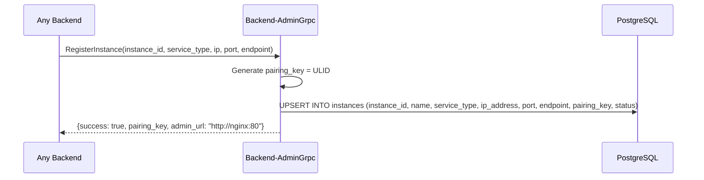
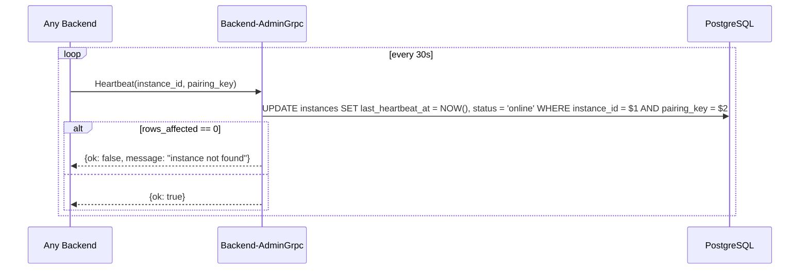
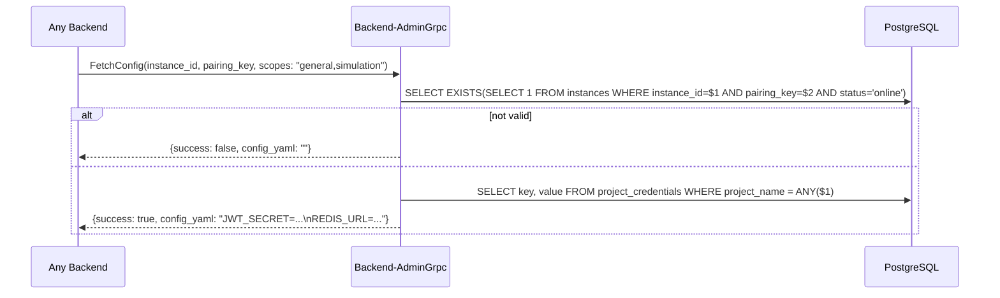

# Backend-AdminGrpc — Admin Pairing Gateway — Product Requirements Document

> **Stack:** Rust (tokio/tonic)
> **Status:** Complete · **Date:** 2026-09-01**
> **Architecture:** Thin gRPC gateway, no Laravel dependency

---

## 1. Context

`Backend-AdminGrpc` is the Admin Panel's gRPC gateway — a thin, stateless Rust binary that
exposes `AdminPairingService` on port **50052**. It is co-deployed in the same Docker network
as the other backends and reads the `admin_panel` PostgreSQL database directly (no Laravel).

Laravel (PHP) does not natively support gRPC server routing, so pairing is delegated to this
dedicated Rust service instead of embedding the `grpc` PHP extension in the Admin Panel image.

---

## 2. Service Topology

```mermaid
flowchart LR
    BG[":8081 General"]
    BM[":8083 Matchmaking"]
    BMG[":8084 MatchGames"]
    BS[":8082 Simulation"]
    BAG[":50052 AdminGrpc"]
    DB[":5432 PostgreSQL<br/>admin_panel"]

    BG <-gRPC-->|"RegisterInstance<br/>Heartbeat<br/>FetchConfig"| BAG
    BM <-gRPC--> BAG
    BMG <-gRPC--> BAG
    BS <-gRPC--> BAG
    BAG <-->|"instances, project_credentials"| DB
```

---

## 3. Requirements

| ID | Requirement | Status |
|----|-------------|--------|
| AG-1 | gRPC `RegisterInstance` RPC — upsert instance + generate pairing_key | Done |
| AG-2 | gRPC `Heartbeat` RPC — update `last_heartbeat_at` + `status` | Done |
| AG-3 | gRPC `FetchConfig` RPC — return `project_credentials` rows as `key=value\n` | Done |
| AG-4 | Generate ULID-based `pairing_key` on RegisterInstance | Done |
| AG-5 | Dockerfile multi-stage build, expose port 50052 | Done |
| AG-6 | Idempotent instance registration (upsert on instance_id) | Done |

---

## 4. Proto — AdminPairingService

Proto file: `Backend/Shared-Files/proto/admin_service.proto` (symlinked into this repo).

```protobuf
service AdminPairingService {
  rpc RegisterInstance(RegisterInstanceRequest) returns (RegisterInstanceResponse);
  rpc Heartbeat(HeartbeatRequest) returns (HeartbeatResponse);
  rpc FetchConfig(FetchConfigRequest) returns (FetchConfigResponse);
}
```

### RegisterInstance



### Heartbeat



### FetchConfig



---

## 5. Database Schema (admin_panel)

Only reads/writes the `instances` and `project_credentials` tables.

### `instances` table

| Column | Type | Notes |
|--------|------|-------|
| `id` | `bigint` | PK |
| `instance_id` | `text` | **ULID**, unique — set by backend, written by BAG |
| `name` | `text` | Auto-generated: `{service_type}-{instance_id[..8]}` |
| `service_type` | `service_type_enum` | `general` \| `simulation` \| `matchmaking` \| `matchgames` |
| `ip_address` | `text` | |
| `port` | `integer` | |
| `endpoint` | `text` | gRPC or HTTP base URL |
| `pairing_key` | `text` | **ULID**, unique — generated by BAG on RegisterInstance |
| `status` | `text` | `online` \| `offline` |
| `last_heartbeat_at` | `timestamp` | Updated by Heartbeat RPC |

### `project_credentials` table

| Column | Type | Notes |
|--------|------|-------|
| `id` | `bigint` | PK |
| `project_name` | `text` | e.g. `general`, `simulation`, `Shared` |
| `key` | `text` | Credential name |
| `value` | `text` | Credential value |

---

## 6. Config

| Env Var | Default | Description |
|---------|---------|-------------|
| `GRPC_ADDR` | `0.0.0.0:50052` | gRPC listen address |
| `DATABASE_URL` | `postgres://.../admin_panel` | PostgreSQL connection string |

---

## 7. Running

```bash
# Standalone
cargo run

# Docker
docker compose up backend-admin-grpc
```

## 8. Verification

```bash
cd Backend/Backend-AdminGrpc && cargo build --release
```
