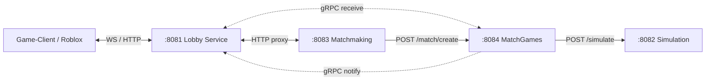
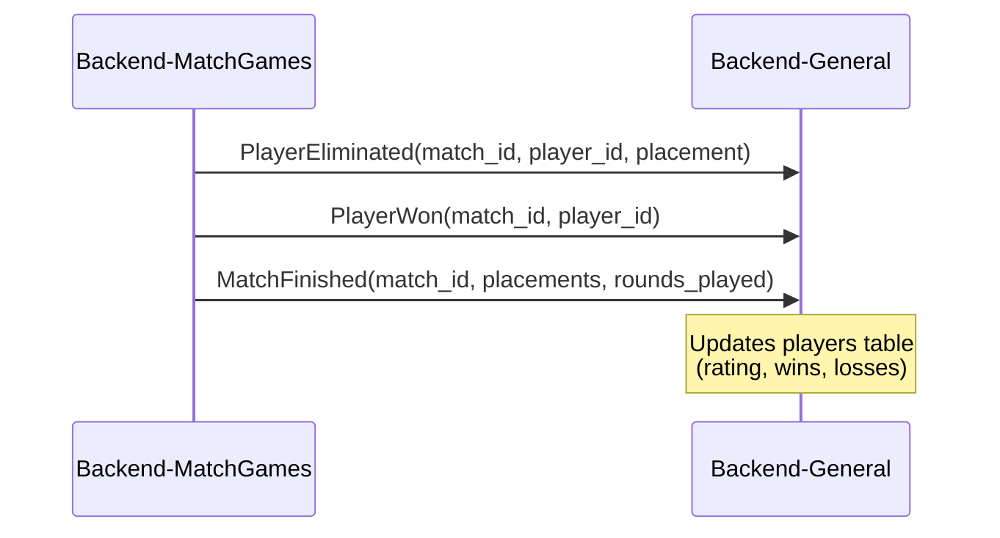

# Backend-General — Lobby Service — Product Requirements Document (PRD)

> **Stack:** Rust (tokio/axum/tonic)
> **Status:** ~80% complete · **Date:** 2026-08-31**
> **Architecture:** 4-service split (General → Matchmaking → MatchGames → Simulation)

---

## 1. Context

The Lobby Service for AutoChess: player authentication (WebSocket + HTTP REST), profile/history
queries, and matchmaking proxy. Boots HTTP REST (port 8081), gRPC (port 50051), and WebSocket hub.

**Matchmaking is delegated** to Backend-Matchmaking (port 8083). This service does NOT hold a queue.
It proxies queue join/leave/status requests via HTTP, and receives match results via gRPC callbacks
from Backend-MatchGames.

---

## 2. Service Topology



---

## 3. Requirements

| ID | Requirement | Status |
|----|-------------|--------|
| BG-1 | Player registration/login (bcrypt + JWT HS256, Roblox auto-login) | Done |
| BG-2 | JWT-protected REST (Bearer token) | Done |
| BG-3 | Proxy queue requests to Backend-Matchmaking via HTTP | Done |
| BG-4 | gRPC `MatchNotification` server (receives results from MatchGames) | Done |
| BG-5 | Match history + leaderboard persistence | Done |
| BG-6 | WebSocket hub (auth, queue proxy, profile, history, fan-out) | Done |
| BG-7 | Leaderboard (`ORDER BY rating DESC`) | Done |
| BG-8 | Roblox HTTP-only API (no WebSocket) | Done |
| BG-9 | Apply rating/wins/losses to `players` table after gRPC callbacks | Done |
| BG-10 | gRPC pairing with Admin Panel (ULID instance_id + RegisterInstance + heartbeat) | Done |
| BG-11 | Unit / integration tests | Pending |
| BG-12 | Real ELO / ranked season logic | Planned |
| BG-13 | Friendship / social system | Planned |

---

## 4. REST Endpoints

| Method | Path | Auth | Purpose |
|--------|------|------|---------|
| POST | `/api/auth/register` | public | Create player (standard) |
| POST | `/api/auth/login` | public | Login → `{token, player}` |
| POST | `/api/players/register` | public | Create player (admin portal) |
| POST | `/api/players/login` | public | Login (admin portal) |
| POST | `/api/v1/pair` | pairing | Admin Panel pairing (writes pairing.json) |
| POST | `/api/v1/unpair` | pairing_key | Depair |
| GET | `/api/admin/leaderboard` | public | Top players |
| GET | `/api/admin/players` | JWT | List players |
| GET | `/api/admin/matches` | JWT | List matches |
| POST | `/api/matchmaking/join` | JWT | Join queue → proxies to Matchmaking |
| POST | `/api/matchmaking/leave` | JWT | Leave queue → proxies to Matchmaking |
| GET | `/api/matchmaking/status` | JWT | Queue size → proxies to Matchmaking |
| GET | `/api/profile` | JWT | Current player profile |
| GET | `/api/history` | JWT | Current player match history |
| GET | `/ws` | socket | WebSocket upgrade (Godot client) |

### Roblox HTTP API (no WebSocket)

| Method | Path | Body / Params | Purpose |
|--------|------|---------------|---------|
| POST | `/api/auth/login` | `{user_id}` | Roblox auto-login/register (no password) |
| POST | `/api/matchmaking/join` | Bearer token | Join queue |
| GET | `/api/matchmaking/status` | Bearer token | Poll queue position |
| GET | `/api/match/state?match_id=` | Bearer token | Poll match state |

---

## 5. WebSocket Protocol (Godot Client)

### Client Actions (`type` field)

`login`, `register`, `queue_join`, `queue_leave`, `get_profile`, `get_history`

### Server Events (`type` field)

`auth_success`, `auth_error`, `queue_update`, `match_found`, `profile`, `history`,
`eliminated`, `victory`, `error`

`queue_join` / `queue_leave` are proxied via HTTP to `http://backend-matchmaking:8083/api/queue/join|leave`.
`match_found` event includes `server_url: "http://backend-matchgames:8084"`.

---

## 6. gRPC — Receives from Backend-MatchGames

Proto at `proto/match_service.proto`. Backend-MatchGames calls these when matches finish:



---

## 7. Database

PostgreSQL `admin_panel` database (migrations via Admin-Panel Laravel):

- `players` — id, username, password_hash, display_name, **external_id** (unique string),
  **source** (`WEB`/`GAME`/`ROBLOX`), rating, wins, losses, timestamps
- `matches` — id, ulid, **status** (`starting`/`running`/`completed`/`canceled`/`terminated`),
  **player_count**, created_at, updated_at
- `match_history` — id, **match_id** (FK→matches), **player_id** (FK→players),
  **placement**, **is_winner**, created_at

---

## 8. Config

Environment variables: `PORT` (8081), `GRPC_PORT` (50051), `DATABASE_URL`, `REDIS_URL`,
`JWT_SECRET`, **`BACKEND_MATCHMAKING_URL`** (default `http://backend-matchmaking:8083`),
`BACKEND_SIMULATION_URL`.

Config resolution: env → `pairing.json` → Admin Panel remote export via gRPC.

### Instance Pairing (gRPC)

```
mermaid
sequenceDiagram
    participant BG as Backend-General
    participant BAG as Backend-AdminGrpc
    participant DB as PostgreSQL

    Note over BG: First boot — no pairing.json
    BG->>BAG: RegisterInstance(ulid, "general", ip, port, endpoint)
    BAG->>DB: INSERT/UPDATE instances
    BAG-->>BG: {success: true, pairing_key, admin_url}
    BG->>BG: save {instance_id, pairing_key, admin_url} to pairing.json
    loop every 30s
        BG->>BAG: Heartbeat(instance_id, pairing_key)
        BAG->>DB: UPDATE last_heartbeat_at
        BAG-->>BG: {ok: true}
    end
```

---

## 9. Verification

```bash
cd Backend/Backend-General && cargo test && cargo build --release
```
