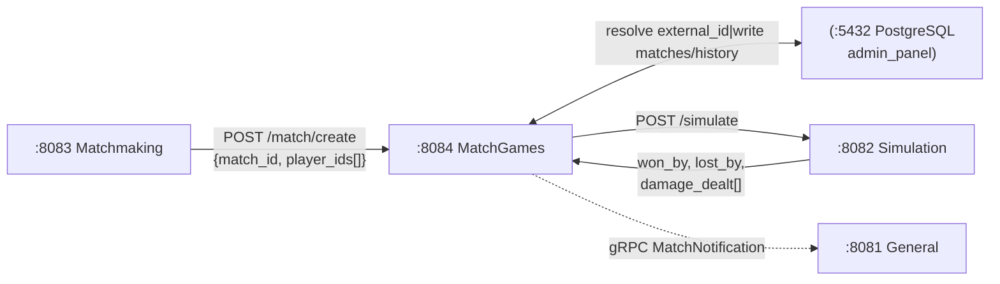
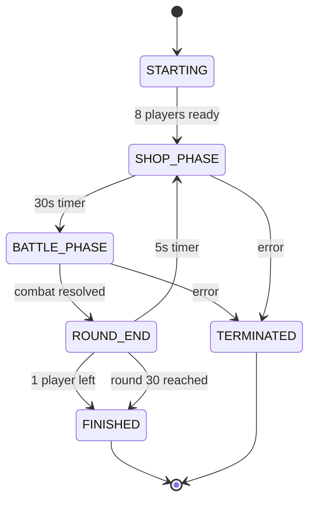
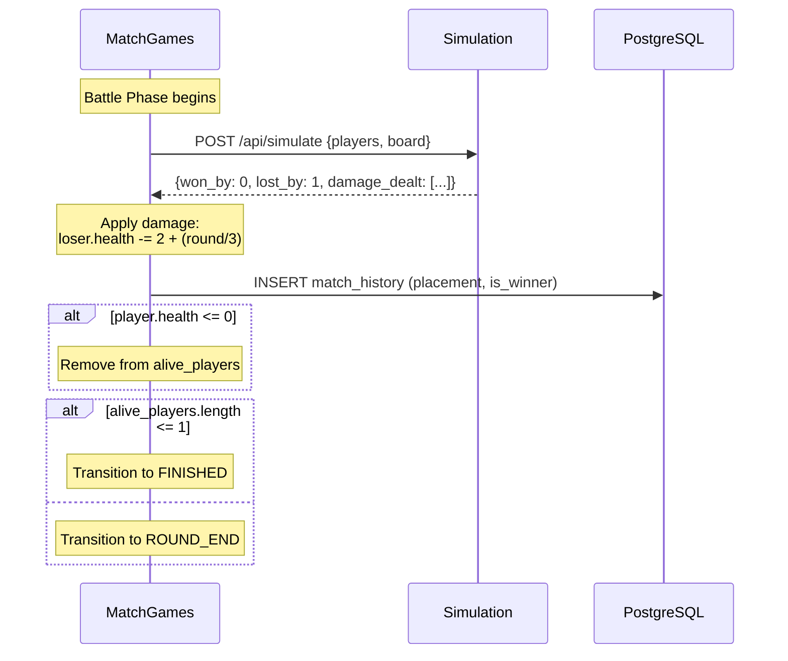
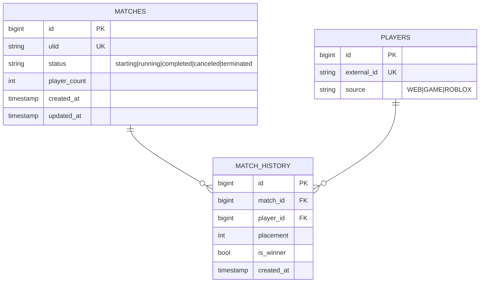

# Backend-MatchGames — Match Lifecycle — Product Requirements Document (PRD)

> **Stack:** Rust (tokio/axum)
> **Status:** ~80% complete · **Date:** 2026-08-31**
> **Architecture:** 4-service split (General → Matchmaking → MatchGames → Simulation)

---

## 1. Context

Match lifecycle orchestration service. Receives match creation requests from Backend-Matchmaking,
manages in-memory match state, runs round loops (shop → battle → round-end), delegates battle
simulation to Backend-Simulation, and writes results to the database.

Receives players as **external IDs** (from Matchmaking) and resolves them to internal player IDs
via DB lookup.

---

## 2. Service Topology



---

## 3. Requirements

| ID | Requirement | Status |
|----|-------------|--------|
| MG-1 | `POST /api/match/create` (resolve external IDs, write to DB) | Done |
| MG-2 | In-memory `MatchState` registry (DashMap) | Done |
| MG-3 | Round loop: shop_phase → battle_phase → round_end | Done |
| MG-4 | Call Backend-Simulation for battle resolution | Done |
| MG-5 | Apply battle damage (loser: `2 + round/3` HP) | Done |
| MG-6 | Eliminate players at 0 HP | Done |
| MG-7 | Write `match_history` entries after each battle | Done |
| MG-8 | Update `matches.status` to completed/terminated | Done |
| MG-9 | WebSocket `/ws/match/:id` for live match events | Partial |
| MG-10 | gRPC pairing with Admin Panel (ULID instance_id + RegisterInstance + heartbeat) | Done |
| MG-11 | gRPC client to notify Backend-General on match end | Planned |

---

## 4. Match Phase Flow



**Phase durations:**
- Shop Phase: 30 seconds
- Round End: 5 seconds
- Battle Phase: variable (determined by combat)

---

## 5. API Endpoints

| Method | Path | Body / Params | Response |
|--------|------|---------------|----------|
| POST | `/api/match/create` | `{"match_id": "ULID", "player_ids": ["RBLX...","RBLX..."]}` | `{"success": true, "match_id": "ULID"}` |
| GET | `/api/match/:id/state` | — | `MatchState` JSON |
| WS | `/ws/match/:id` | — | Live match events stream |
| GET | `/health` | — | `"ok"` |

### `GET /api/match/:id/state` Response

```json
{
  "match_id": "01ARZ3NYREPGMT7RRFF6699PS",
  "players": [
    {
      "player_id": 1,
      "external_id": "RBLX12345_Sfx",
      "gold": 50,
      "health": 100,
      "board": [],
      "bench": [],
      "level": 1
    }
  ],
  "phase": "shop_phase",
  "round": 3,
  "started_at": "2026-08-31T00:00:00Z",
  "updated_at": "2026-08-31T00:01:30Z"
}
```

---

## 6. Battle Resolution



---

## 7. Database Schema (admin_panel)



---

## 8. Config

| Env Var | Default | Description |
|---------|---------|-------------|
| `DATABASE_URL` | `postgres://.../admin_panel` | PostgreSQL connection |
| `BACKEND_SIMULATION_URL` | `http://backend-simulation:8082` | Simulation base URL |
| `BACKEND_GENERAL_URL` | `http://backend-general:8081` | General lobby base URL |
| `ADMIN_GRPC_ADDR` | `localhost:50052` | Backend-AdminGrpc gRPC address |

Config resolution: env → `pairing.json` → Admin Panel remote export.

---

## 9. Verification

```bash
cd Backend/Backend-MatchGames && cargo test && cargo build --release
```
