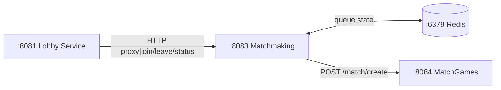
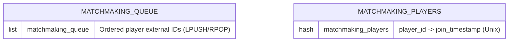
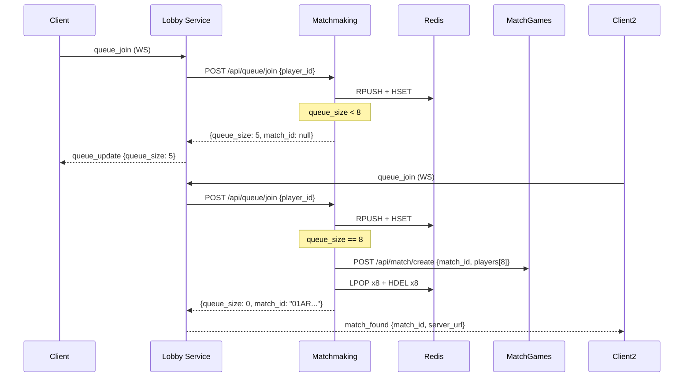

# Backend-Matchmaking — Matchmaking Queue — Product Requirements Document (PRD)

> **Stack:** Rust (tokio/axum)
> **Status:** ~90% complete · **Date:** 2026-08-31**
> **Architecture:** 4-service split (General → Matchmaking → MatchGames → Simulation)

---

## 1. Context

Stateless Redis-backed matchmaking queue service. Collects players waiting for a match and
batches them into groups of 8, then notifies Backend-MatchGames to create a match.

Receives queue join/leave/status requests proxied from Backend-General. Does NOT manage match
state or player ratings.

---

## 2. Service Topology



---

## 3. Requirements

| ID | Requirement | Status |
|----|-------------|--------|
| MM-1 | Redis-backed FIFO queue (`matchmaking:queue` LIST) | Done |
| MM-2 | Player presence hash (`matchmaking:players` HASH) | Done |
| MM-3 | Prevent duplicate queue entries | Done |
| MM-4 | Batch 8 players → notify Backend-MatchGames | Done |
| MM-5 | HTTP REST endpoints (join/leave/status/health) | Done |
| MM-6 | gRPC pairing with Admin Panel (ULID instance_id + RegisterInstance + heartbeat) | Done |
| MM-7 | ULID generation for match_id | Done |
| MM-8 | Configurable batch size (default 8) | Pending |

---

## 4. Redis Data Model



- `matchmaking:queue` (LIST): ordered player external IDs
- `matchmaking:players` (HASH): player_id → join_timestamp (Unix)

---

## 5. API Endpoints

| Method | Path | Body | Response |
|--------|------|------|----------|
| POST | `/api/queue/join` | `{"player_id": "RBLX..._Suffix"}` | See below |
| POST | `/api/queue/leave` | `{"player_id": "RBLX..._Suffix"}` | `{"queue_size": int}` |
| GET | `/api/queue/status` | — | `{"queue_size": int}` |
| GET | `/health` | — | `"ok"` |

### `POST /api/queue/join` Responses

**Queued (not enough players):**
```json
{
  "queue_size": 5,
  "match_id": null,
  "players": null
}
```

**Matched (8 players reached):**
```json
{
  "queue_size": 0,
  "match_id": "01ARZ3NYREPGMT7RRFF6699PS",
  "players": ["RBLX..._Sfx","RBLX..._Sfx","RBLX..._Sfx","RBLX..._Sfx","RBLX..._Sfx","RBLX..._Sfx","RBLX..._Sfx","RBLX..._Sfx"]
}
```

---

## 6. Batch Flow



---

## 7. Config

| Env Var | Default | Description |
|---------|---------|-------------|
| `REDIS_URL` | `redis://redis:6379` | Redis connection string |
| `BACKEND_MATCHGAMES_URL` | `http://backend-matchgames:8084` | MatchGames base URL |
| `ADMIN_GRPC_ADDR` | `localhost:50052` | Backend-AdminGrpc gRPC address |

Config resolution: env → `pairing.json` → Admin Panel remote export.

---

## 8. Verification

```bash
cd Backend/Backend-Matchmaking && cargo test && cargo build --release
```
