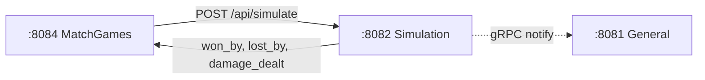
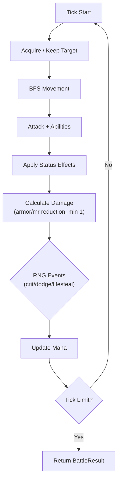

# Backend-Simulation — Combat Engine — Product Requirements Document (PRD)

> **Stack:** Rust (tokio/axum)
> **Status:** ~75% complete · **Date:** 2026-08-31**
> **Architecture:** 4-service split (General → Matchmaking → MatchGames → Simulation)

---

## 1. Context

The Combat Engine for AutoChess: deterministic tick-by-tick battle simulation, synergy/trait
evaluation, and stat resolution. Receives battle requests from **Backend-MatchGames** via
`POST /api/simulate` and returns the battle result.

It does NOT manage match lifecycle, round loops, or player ratings. It is a pure computation
service — stateless with respect to the match.

---

## 2. Service Topology



---

## 3. Requirements

| ID | Requirement | Status |
|----|-------------|--------|
| BS-1 | Deterministic tick combat (crit/dodge/lifesteal/mana) | Done |
| BS-2 | 5 ability types (`single_target`, `area_damage`, `heal`, `buff`, `multi_arrow`) | Done |
| BS-3 | 5 status effects (`stun`, `silence`, `burn`, `freeze`, `hot`) | Done |
| BS-4 | Synergy evaluation + stat buffs | Partial |
| BS-5 | BFS pathfinding + assassin backline jump | Done |
| BS-6 | Hero/item/skill/synergy registry | Partial |
| BS-7 | Deterministic RNG (seeded for replay) | Done |
| BS-8 | HTTP `/api/simulate` endpoint (called by MatchGames) | Done |
| BS-9 | gRPC pairing with Admin Panel (ULID instance_id + RegisterInstance + heartbeat) | Done |
| BS-10 | Item equipping | Pending |
| BS-11 | Unit / integration tests | Pending |

---

## 4. HTTP Endpoints

| Method | Path | Purpose |
|--------|------|---------|
| POST | `/api/simulate` | Battle simulation (called by Backend-MatchGames) |
| POST | `/api/sample` | Sample `BattleConfig` |
| GET | `/api/heroes` | List registered heroes |
| GET | `/api/skills` | List registered skills |
| GET | `/api/items` | List registered items |
| GET | `/api/synergies` | List registered synergies |
| GET | `/health` | Health check |

### `POST /api/simulate` Request

```json
{
  "players": [
    {
      "player_id": 1,
      "external_id": "RBLX12345_Suffix",
      "board": ["hero_id_1", "hero_id_2"],
      "level": 5
    }
  ]
}
```

### `POST /api/simulate` Response

```json
{
  "won_by": 0,
  "lost_by": 1,
  "damage_dealt": [45, 0, 30, 0, 0, 0, 0, 0]
}
```

---

## 5. Determinism

Combat is **deterministic**: given the same `BattleConfig.seed`, the same inputs always produce
the same outputs. This enables replay — the Game-Client can replay matches locally.

- `internal/rng`: wraps `rand::rngs::StdRng` seeded from `BattleConfig.Seed`
- Units processed in sorted-ID order
- Movement: deterministic BFS direction order
- Tie-breaking: nearest-enemy by (row, col)
- No external randomness (no system time, no OS entropy)

---

## 6. Combat Engine

Tick-by-tick simulation (default **100 ticks/sec**, max **2000 ticks** per round):



- **Targeting**: keep current in-range target; nearest in-range enemy otherwise
- **Damage**: physical/magic reduced by armor/magic-resist (min 1)
- **RNG events**: crit, dodge, lifesteal via seeded `DeterministicRNG`
- **Mana**: gained per hit; victims gain mana on damage taken
- **Abilities**: `single_target`, `area_damage`, `heal`, `buff`, `multi_arrow`
- **Status effects**: `stun`, `silence`, `burn`, `freeze`, `hot`
- **Movement**: BFS pathfinding; assassins jump to backline pre-battle

---

## 7. Database

PostgreSQL `admin_panel` database (read-only: `players` table for player names during match).

---

## 8. Config

Environment variables: `PORT` (8082), `DATABASE_URL`, `BACKEND_GENERAL_GRPC_ADDR`,
`ADMIN_GRPC_ADDR` (default `localhost:50052`).

Config resolution: env → `pairing.json` → Admin Panel remote export via gRPC.

---

## 9. Verification

```bash
cd Backend/Backend-Simulation && cargo test && cargo test --package engine -- --nocapture && cargo build --release
```
