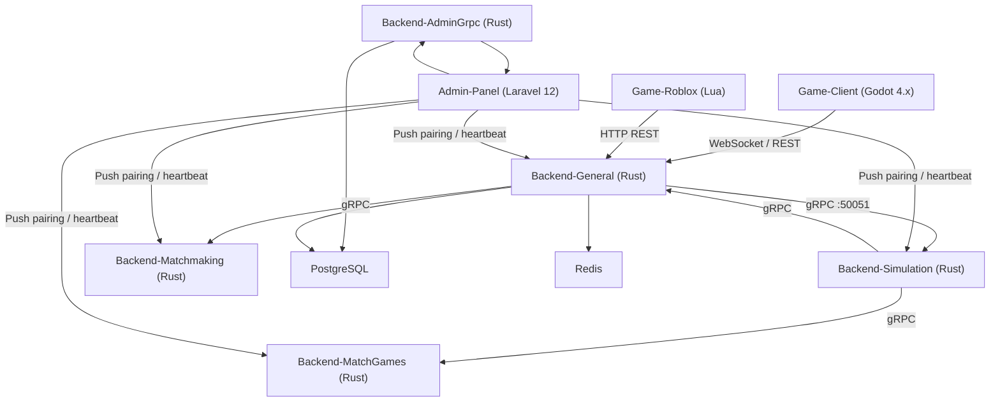

# AutoChess Fullstack

Modular auto-battler inspired by Teamfight Tactics and Magic Chess.
Players draft units, manage economy, and watch their team battle automatically on a 6x7 grid.

## Architecture



## Submodules

| Submodule | Stack | Role |
|-----------|-------|------|
| Admin-Panel | Laravel 12 (PHP 8.2) | Fleet management, secrets, pairing, user accounts |
| Backend-AdminGrpc | Rust (tokio/tonic) | gRPC gateway — instance registration, heartbeat, credential export |
| Backend-General | Rust (tokio/axum/tonic) | Players, auth, WS hub, HTTP REST for Roblox |
| Backend-Matchmaking | Rust (tokio/axum) | Match queue, lobby, player pairing before match |
| Backend-Simulation | Rust (tokio/axum) | Tick-by-tick combat simulation, deterministic engine |
| Backend-MatchGames | Rust (tokio/axum) | Round management, game phases, win/loss tracking |
| Game-Client | Godot 4.x (GDScript) | Visual playback, WebSocket consumer |
| Game-Roblox | Lua (Roblox) | HTTP REST client — Roblox platform support |

Shared protos: `Backend/Shared-Files/proto/`

## Service Ports (docker-compose)

| Service | Port | Notes |
|---------|------|-------|
| Admin Panel (nginx) | 3001 | Laravel interface |
| Backend-AdminGrpc | 50052 (gRPC) | Instance pairing gateway |
| Backend-General | 8081 (HTTP) / 50051 (gRPC) | REST + WS + gRPC server |
| Backend-Matchmaking | 8083 (HTTP) | Match queue and lobby |
| Backend-Simulation | 8082 (HTTP) | Combat simulation engine |
| Backend-MatchGames | 8084 (HTTP) | Round and game phase management |
| PostgreSQL | 5432 | `admin_panel` + `autochess` DBs |
| Redis | 6379 | Matchmaking queue / caching |

## Quick Start

```bash
# clone with submodules
git clone --recursive https://github.com/YueMi-Development/AutoChess-Game.git
cd AutoChess-Fullstack

# start infrastructure
cp .env.example .env
docker compose up -d --build

# seed admin panel
docker compose exec admin-panel php artisan migrate --force
docker compose exec admin-panel php artisan db:seed --class=InitialSetupSeeder --force

# backends (Rust)
cd Backend/Backend-AdminGrpc && cargo test && cargo build --release
cd Backend/Backend-General && cargo test && cargo build --release
cd Backend/Backend-Matchmaking && cargo test && cargo build --release
cd Backend/Backend-Simulation && cargo test && cargo build --release
cd Backend/Backend-MatchGames && cargo test && cargo build --release
```

Admin panel: http://localhost:3001
Backend-AdminGrpc: grpc://localhost:50052
Backend-General: http://localhost:8081 (WS `/ws`, gRPC `:50051`)
Backend-Matchmaking: http://localhost:8083
Backend-Simulation: http://localhost:8082
Backend-MatchGames: http://localhost:8084

## Backend Pairing

All backend instances register with the Admin Panel on startup via `Backend-AdminGrpc` (gRPC port 50052).
The Admin Panel pushes `pairing_key` + `admin_url` to each instance, which is persisted to `pairing.json`.
Heartbeats run every 30 s. See `Documentation/CREDENTIALS.md` for the full credential flow.

## Documentation

- [Documentation/PLAN.md](Documentation/PLAN.md) - Product requirements and architecture
- [Documentation/PROGRESS.md](Documentation/PROGRESS.md) - Component progress tracker
- [Documentation/CREDENTIALS.md](Documentation/CREDENTIALS.md) - Credential flow between Admin and backends
- [Documentation/INSTALL.md](Documentation/INSTALL.md) - Full setup guide

## Open Source & License

The **root repository** (this repo) is open source under [CC BY 4.0](https://creativecommons.org/licenses/by/4.0/) — see [LICENSE](LICENSE). Its purpose is to document the overall architecture and how the system works, so that others can learn from or reuse the design patterns. It is not a working game or a production deployment.

**All submodules are proprietary and private.** They are not covered by CC BY 4.0, may not be copied, forked, or used in any public or commercial project without written permission.

| Scope | License | Public Use |
|-------|---------|------------|
| Root repo docs, diagrams, PRDs, architecture | CC BY 4.0 | Allowed with attribution |
| All submodules (Admin-Panel, backends, clients) | Proprietary / Private | Not allowed |
