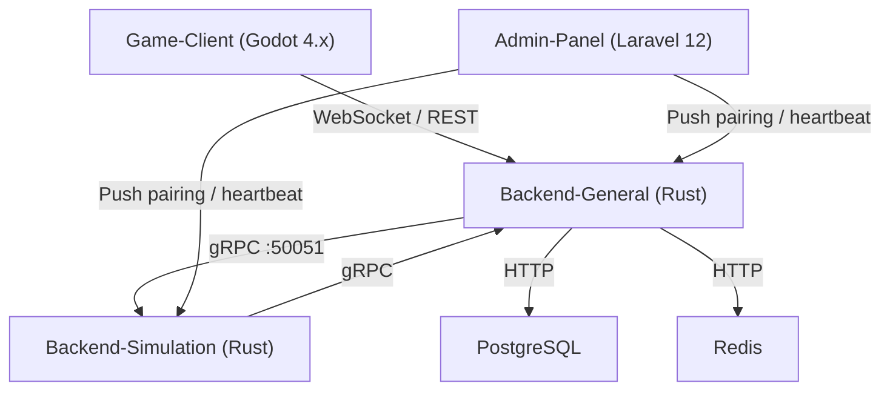

# AutoChess Fullstack

Modular auto-battler inspired by Teamfight Tactics and Magic Chess.
Players draft units, manage economy, and watch their team battle automatically on a 6x7 grid.

## Architecture



## Submodules

| Submodule | Stack | Role |
|-----------|-------|------|
| Admin-Panel | Laravel 12 (PHP 8.2) | Fleet management, secrets, pairing |
| Backend-General | Rust (tokio/axum/tonic) | Players, auth, matchmaking, WS hub |
| Backend-Simulation | Rust (tokio/axum) | Match engine, combat, shop, synergies |
| Game-Client | Godot 4.x (GDScript) | Visual playback, WebSocket consumer |
| Game-Website | (undecided) | Landing page, player portal |

Shared proto: `Backend/Shared-Files/proto/match_service.proto`

## Quick Start

```bash
# clone with submodules
git clone --recursive https://github.com/YueMi-Development/AutoChess-Game.git
cd AutoChess-Fullstack

# start infrastructure
cp .env.example .env
docker compose up -d --build

# seed admin panel
docker compose exec admin-panel php artisan migrate --force
docker compose exec admin-panel php artisan db:seed --class=InitialSetupSeeder --force

# backends (Rust)
cd Backend/Backend-General  && cargo test && cargo build --release
cd Backend/Backend-Simulation && cargo test && cargo build --release
```

Admin panel: http://localhost:3001
Backend-General: http://localhost:8081 (WS `/ws`, gRPC `:50051`)
Backend-Simulation: http://localhost:8082

## Documentation

- [Documentation/PLAN.md](Documentation/PLAN.md) - Product requirements and architecture
- [Documentation/PROGRESS.md](Documentation/PROGRESS.md) - Component progress tracker
- [Documentation/CREDENTIALS.md](Documentation/CREDENTIALS.md) - Credential flow between Admin and backends
- [Documentation/INSTALL.md](Documentation/INSTALL.md) - Full setup guide

## License

Proprietary. See [LICENSE](LICENSE).
