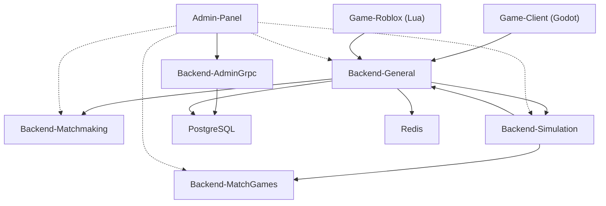

# AutoChess Fullstack

An open-source modular auto-battler architecture inspired by Teamfight Tactics and Magic Chess.

## What is this?

This repository documents the architecture and design of a fullstack auto-battler game system. It is **not** a runnable game — it is a reference implementation showing how the pieces fit together.

The root repo is open to help others learn from or reuse the design patterns. **All submodules are proprietary and private.**

## Components

- **Admin-Panel** — Fleet management, secrets, pairing, player accounts
- **Backend-AdminGrpc** — Instance registration and credential gateway
- **Backend-General** — Player auth, matchmaking, WebSocket hub, HTTP REST for Roblox clients
- **Backend-Matchmaking** — Match queue and lobby management
- **Backend-Simulation** — Deterministic tick-by-tick combat engine
- **Backend-MatchGames** — Round management and game phases
- **Game-Client** — Godot 4.x visual client with WebSocket support
- **Game-Roblox** — Roblox platform client using HTTP REST

## Documentation

| Topic | File |
|-------|------|
| Architecture & features | `Documentation/PLAN.md` |
| Setup guide | `Documentation/INSTALL.md` |
| Credential flow | `Documentation/CREDENTIALS.md` |
| Implementation progress | `Documentation/PROGRESS.md` |

## Architecture

## License

The **root repository** is [CC BY 4.0](https://creativecommons.org/licenses/by/4.0/). See [LICENSE](LICENSE).

| Scope | License | Public Use |
|-------|---------|------------|
| Root repo (docs, diagrams, PRDs, architecture) | CC BY 4.0 | Allowed with attribution |
| All submodules | Proprietary / Private | Not allowed |
